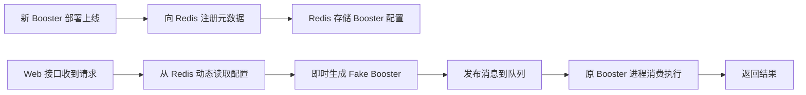

# 为什么 funboost.faas 支持热加载函数

## 核心问题

当一个新的 `@boost` 装饰器的消费函数部署后，**web 服务无需重启**，即可通过 HTTP 接口调用该函数并获取结果。这种热加载能力是如何实现的？

## 底层原理分析

### 1. 架构概览



### 2. 关键机制：基于 Redis 的元数据注册

当 `@boost` 装饰的函数启动消费时，会自动将 `BoosterParams` 配置信息序列化后写入 Redis：

| Redis Key | 存储内容 |
|-----------|----------|
| `funboost_all_queue_names` | 所有队列名称集合 |
| `funboost.project_name:{project}` | 按项目分组的队列名 |
| `funboost_queue__consumer_parmas` | 每个队列的完整 BoosterParams 配置（JSON） |

**核心配置示例**（存储在 Redis 中）：

```json
{
  "queue_name": "test_funboost_faas_queue",
  "broker_kind": "REDIS",
  "auto_generate_info": {
    "final_func_input_params_info": {
      "func_name": "add",
      "must_arg_name_list": ["x", "y"],
      "optional_arg_name_list": []
    }
  }
}
```

### 3. 热加载的核心实现

热加载的核心在 [SingleQueueConusmerParamsGetter._gen_booster_by_redis_meta_info](file:///d:/codes/funboost/funboost/core/active_cousumer_info_getter.py#L565-L617) 方法：

```python
def _gen_booster_by_redis_meta_info(self) -> Booster:
    # 1. 从 Redis 读取配置（带缓存，60秒过期）
    booster_params = self.get_one_queue_params_use_cache()
    
    # 2. 根据函数入参信息生成伪函数
    redis_final_func_input_params_info = booster_params['auto_generate_info']['final_func_input_params_info']
    fake_fun = FakeFunGenerator.gen_fake_fun_by_params(redis_final_func_input_params_info)
    
    # 3. 即时创建 Fake Booster（仅用于发布消息）
    booster_params['consuming_function'] = fake_fun
    booster_params['is_fake_booster'] = True
    
    booster = Booster(BoosterParams(**booster_params))(fake_fun)
    return booster
```

### 4. 发布接口的调用链

[publish_msg](file:///d:/codes/funboost/funboost/faas/fastapi_adapter.py#L354-L407) 接口的核心逻辑：

```python
@fastapi_router.post("/publish")
async def publish_msg(msg_item: MsgItem):
    # 核心：通过 queue_name 从 Redis 动态获取配置并生成 publisher
    publisher = SingleQueueConusmerParamsGetter(msg_item.queue_name).gen_publisher_for_faas()
    
    # 发布消息
    async_result = await publisher.aio_publish(msg_item.msg_body)
```

## 热加载的关键设计

### ✅ 为什么能热加载

| 设计要点 | 说明 |
|---------|------|
| **元数据与执行分离** | Web 只需要知道如何发布消息，不需要真正的消费函数代码 |
| **Redis 作为注册中心** | Booster 上线时自动注册，Web 动态发现 |
| **Fake Booster 机制** | 根据函数签名信息生成伪函数，只用于消息发布和参数校验 |
| **队列名称发现** | 从 `funboost_all_queue_names` 集合动态获取所有可用队列 |

### ✅ 对比传统 Web 开发

| 对比项 | 传统 Web | funboost.faas |
|--------|---------|---------------|
| 新增功能 | 需要新增接口代码 + 重启服务 | 只需部署 Booster，Web 无需修改 |
| 接口发现 | 需要手动编写文档 | 自动从 Redis 获取函数签名 |
| 参数校验 | 需要手动编写校验逻辑 | 自动根据 `final_func_input_params_info` 校验 |

## 使用示例

### 1. 消费端（独立部署）

```python
# task_funs_dir/add.py
from funboost import boost, BoosterParams

@boost(BoosterParams(
    queue_name="test_funboost_faas_queue",
    is_send_consumer_heartbeat_to_redis=True,  # 必须开启心跳上报
    is_using_rpc_mode=True,  # 支持 RPC 模式获取结果
))
def add(x: int, y: int = 10):
    return x + y
```

### 2. Web 端（无需修改代码）

```python
# example_fastapi_faas.py
from fastapi import FastAPI
from funboost.faas import fastapi_router

app = FastAPI()
app.include_router(fastapi_router)  # 只需这一行
```

### 3. 调用新上线的函数

```bash
# 新 Booster 部署后，立即可调用
curl -X POST http://127.0.0.1:8000/funboost/publish \
  -H "Content-Type: application/json" \
  -d '{"queue_name": "test_funboost_faas_queue", "msg_body": {"x": 10, "y": 20}, "need_result": true}'
```

## 总结

funboost.faas 热加载的核心原理是：

> **将 Booster 配置元数据存储在 Redis 中，Web 接口通过 queue_name 动态从 Redis 读取配置，即时生成 Fake Booster 进行消息发布，无需持有真正的消费函数代码。**

这种设计实现了**配置驱动**而非**代码驱动**，让 Web 服务成为一个通用的消息发布网关，真正的业务逻辑由独立部署的 Booster 进程执行。
